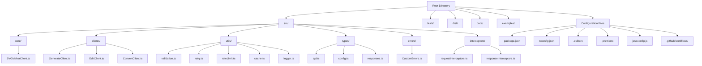

# SVGMaker SDK Development Plan

## 1. Project Structure & Setup



### Core Files and Directories:

1. **src/** - Source code directory
   - **core/** - Core SDK implementation
   - **clients/** - Individual API client implementations
   - **utils/** - Utility functions and helpers
   - **types/** - TypeScript type definitions
   - **errors/** - Custom error classes
   - **interceptors/** - Request/response interceptors

2. **tests/** - Test files organized mirroring the src/ structure
3. **dist/** - Compiled output (CommonJS and ESM)
4. **docs/** - Generated API documentation
5. **examples/** - Example usage code
6. **Configuration Files** - Package configuration, TypeScript, ESLint, etc.

## 2. Core SDK Architecture

```mermaid
classDiagram
    class SVGMakerClient {
        -config: SVGMakerConfig
        -httpClient: HttpClient
        -requestInterceptors: RequestInterceptor[]
        -responseInterceptors: ResponseInterceptor[]
        +constructor(apiKey: string, config?: Partial<SVGMakerConfig>)
        +generate: GenerateClient
        +edit: EditClient
        +convert: ConvertClient
        +setConfig(config: Partial<SVGMakerConfig>): SVGMakerClient
        +addRequestInterceptor(interceptor: RequestInterceptor): SVGMakerClient
        +addResponseInterceptor(interceptor: ResponseInterceptor): SVGMakerClient
    }
    
    class BaseClient {
        #client: SVGMakerClient
        #httpClient: HttpClient
        #config: SVGMakerConfig
        #validateRequest(data: any, schema: Schema): void
        #handleRequest<T>(url: string, options: RequestOptions): Promise<T>
        #applyInterceptors(request: Request): Request
    }
    
    class GenerateClient {
        +execute(params: GenerateParams): Promise<GenerateResponse>
        +withQuality(quality: Quality): GenerateClient
        +withAspectRatio(aspectRatio: AspectRatio): GenerateClient
        +withBackground(background: Background): GenerateClient
        +withStyle(style: Style): GenerateClient
        +withColorMode(colorMode: ColorMode): GenerateClient
        +withStream(stream: boolean): GenerateClient
        +stream(): ReadableStream<GenerateStreamEvent>
    }
    
    class EditClient {
        +execute(image: string|Buffer|ReadableStream, prompt: string|EditPrompt, options?: EditOptions): Promise<EditResponse>
        +withQuality(quality: Quality): EditClient
        +withAspectRatio(aspectRatio: AspectRatio): EditClient
        +withBackground(background: Background): EditClient
        +withMask(mask: string|Buffer|ReadableStream): EditClient
        +withStream(stream: boolean): EditClient
        +stream(): ReadableStream<EditStreamEvent>
    }
    
    class ConvertClient {
        +execute(file: string|Buffer|ReadableStream): Promise<ConvertResponse>
        +withStream(stream: boolean): ConvertClient
        +stream(): ReadableStream<ConvertStreamEvent>
    }
    
    class HttpClient {
        -fetch: typeof fetch
        -defaultOptions: RequestInit
        +request<T>(url: string, options: RequestOptions): Promise<T>
        +get<T>(url: string, options?: RequestOptions): Promise<T>
        +post<T>(url: string, data: any, options?: RequestOptions): Promise<T>
    }
    
    class ErrorHandler {
        +handleHttpError(response: Response): never
        +handleNetworkError(error: Error): never
        +handleValidationError(error: Error): never
        +handleTimeoutError(error: Error): never
        +handleRateLimitError(error: Error): never
    }
    
    SVGMakerClient *-- GenerateClient
    SVGMakerClient *-- EditClient
    SVGMakerClient *-- ConvertClient
    SVGMakerClient *-- HttpClient
    
    BaseClient <|-- GenerateClient
    BaseClient <|-- EditClient
    BaseClient <|-- ConvertClient
    
    BaseClient o-- HttpClient
    BaseClient o-- ErrorHandler
```



## 3. Implementation Details

### 3.1 Core Features

#### Authentication Handling
- API key management via constructor and environment variables
- Automatic inclusion in all requests via request interceptors

#### Type Definitions
- Comprehensive TypeScript interfaces for all API parameters and responses
- Union types for enumerated values (quality, aspect ratio, etc.)
- Proper typing for streaming responses

#### Error Handling
- Custom error classes for different error types:
  - `SVGMakerError` - Base error class
  - `ValidationError` - For input validation failures
  - `APIError` - For API response errors
  - `RateLimitError` - For rate limiting issues
  - `TimeoutError` - For request timeouts
  - `NetworkError` - For network-related issues

#### Request Validation
- Schema-based validation for all API requests
- Detailed error messages for validation failures
- Type-safe parameter handling

#### Retry Logic
- Configurable automatic retry with exponential backoff
- Retry only for specific status codes and error types
- Maximum retry count and backoff factor configuration

#### Rate Limiting
- Built-in rate limiting based on account tier
- Queue system for requests exceeding rate limits
- Configurable rate limit parameters

#### Interceptors
- Request interceptors for modifying requests before sending
- Response interceptors for processing responses before returning
- Ability to add custom interceptors

#### Timeout Handling
- Configurable request timeouts
- Proper error handling for timeouts

#### Caching
- Configurable request caching
- In-memory and custom cache providers
- Cache invalidation strategies

#### Logging
- Configurable logging levels
- Pluggable logging providers
- Request/response logging

### 3.2 API Implementation

#### Generate SVG Client
- Support for all parameters described in the API documentation
- Fluent interface for parameter configuration
- Method chaining for request building
- Support for streaming responses

#### Edit SVG/Image Client
- Support for file paths and readable streams
- Handling of both string and JSON prompts
- Support for all optional parameters
- Method chaining for configuration
- Support for streaming responses

#### Convert Image to SVG Client
- Support for file paths and readable streams
- Validation of supported input formats
- Support for streaming responses

### 3.3 Utility Modules

- HTTP client wrapper for making requests
- File handling utilities for working with files and streams
- Parameter validation utilities
- Response parsing utilities
- Stream handling utilities

## 4. Testing Strategy

### 4.1 Test Types

- **Unit Tests**: For individual functions and classes
- **Integration Tests**: For testing API client interactions
- **E2E Tests**: For full client workflows (with API mocks)

### 4.2 Test Coverage

- Aim for 90%+ test coverage
- Test all error cases and edge conditions
- Test configuration options and parameter combinations

### 4.3 Testing Tools

- Jest for test framework
- Mock Service Worker (MSW) for API mocking
- Custom test utilities for common testing patterns

## 5. Documentation

### 5.1 README.md

- Installation instructions
- Quick start guide
- Basic usage examples
- Configuration options
- Links to detailed documentation

### 5.2 API Documentation

- JSDoc comments for all public methods and classes
- Generated API reference documentation
- Code examples for all API endpoints
- Configuration option documentation

### 5.3 Examples

- Example scripts for common use cases
- TypeScript and JavaScript examples
- Streaming response handling examples
- Error handling examples

## 6. Build & Distribution

### 6.1 Build Process

- TypeScript compilation for type checking
- Bundling with esbuild for optimal package size
- Dual package exports (CJS and ESM)
- Type definition generation

### 6.2 Package Configuration

- Proper package.json configuration for dual package support
- Export maps for directing imports
- Tree-shaking support
- Peer dependencies specification

### 6.3 CI/CD Pipeline

- GitHub Actions workflow for:
  - Code linting
  - Type checking
  - Running tests
  - Building the package
  - Publishing to npm
  - Generating documentation

### 6.4 Version Management

- Semantic versioning
- Automated changelog generation
- Git tagging for releases

## 7. Implementation Plan & Timeline

### Phase 1: Setup and Core Architecture (Week 1)
- Project structure setup
- Core configuration and type definitions
- Base client implementation
- HTTP client implementation
- Error handling system

### Phase 2: API Client Implementation (Week 2)
- Generate SVG client
- Edit SVG/Image client
- Convert Image to SVG client
- Test coverage for API clients

### Phase 3: Advanced Features (Week 3)
- Interceptors implementation
- Retry logic
- Rate limiting
- Logging system

### Phase 4: Documentation & Examples (Week 4)
- JSDoc comments
- README.md creation
- Example scripts
- API documentation generation

### Phase 5: Build & CI/CD (Week 5)
- Build configuration
- Package.json setup
- GitHub Actions workflow
- Release automation

## 8. Code Examples

### 8.1 Basic SDK Usage

```typescript
// Import the SDK
import { SVGMaker } from '@genwave/svgmaker-sdk';

// Create a client instance
const client = new SVGMaker('your-api-key');

// Generate an SVG
const generateResult = await client.generate
  .withPrompt('A minimalist mountain landscape')
  .withQuality('high')
  .withStyle('minimalist')
  .execute();

// Edit an image
const editResult = await client.edit
  .withImage('./input.png')
  .withPrompt('Add a red border')
  .withQuality('medium')
  .withAspectRatio('square')
  .execute();

// Convert an image to SVG
const convertResult = await client.convert
  .withFile('./image.jpg')
  .execute();
```

### 8.2 Streaming Response Handling

```typescript
// Stream a generation response
const stream = client.generate
  .withPrompt('A geometric mountain landscape')
  .withQuality('high')
  .stream();

// Handle stream events
for await (const event of stream) {
  if (event.status === 'processing') {
    console.log(`Progress: ${event.message}`);
  } else if (event.status === 'complete') {
    console.log(`Complete! SVG URL: ${event.svgUrl}`);
  } else if (event.status === 'error') {
    console.error(`Error: ${event.error}`);
  }
}
```

### 8.3 Error Handling

```typescript
try {
  const result = await client.generate
    .withPrompt('A minimalist mountain landscape')
    .withQuality('high')
    .execute();
} catch (error) {
  if (error instanceof SVGMaker.ValidationError) {
    console.error('Invalid parameters:', error.message);
  } else if (error instanceof SVGMaker.APIError) {
    console.error('API error:', error.message, error.code);
  } else if (error instanceof SVGMaker.RateLimitError) {
    console.error('Rate limit exceeded. Try again in', error.retryAfter, 'seconds');
  } else {
    console.error('Unexpected error:', error);
  }
}
```

## 9. Considerations & Challenges

1. **Browser Compatibility**: Although current focus is on Node.js, we're designing with future browser support in mind.
   
2. **File Handling**: Support for file paths and readable streams in a way that can be extended to File/Blob objects later.

3. **Stream Handling**: Properly handling streaming responses in a way that works well with async/await.

4. **Rate Limiting**: Implementing effective rate limiting that respects the API's limits while maximizing throughput.

5. **Error Recovery**: Balancing automatic retries with informative error reporting.

6. **Bundle Size**: Keeping the package size small while providing all necessary functionality.

7. **Documentation**: Creating comprehensive yet approachable documentation for all features.